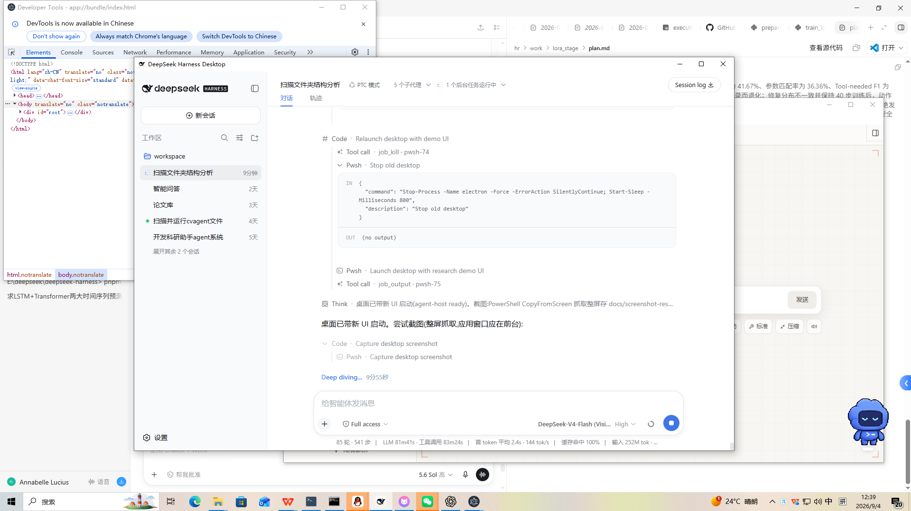
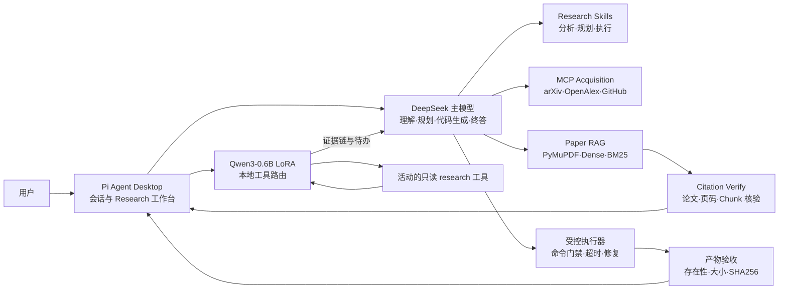
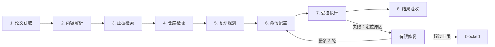

# Pi Research Reproduction Agent

面向科研论文代码复现的桌面端 Coding Agent。系统以 **DeepSeek** 负责对话、推理、复现规划与代码生成，以 LoRA 微调的 **Qwen3-0.6B** 参与本地工具决策，将论文获取、证据检索、代码重建、受控执行、错误修复与产物验收串成可观测工作流。

> 这是基于 [Pi Agent Desktop](https://github.com/DLYZZT/pi-desktop) 的二次开发项目。README 会明确区分上游能力与本项目新增实现，完整实验记录见 [docs/results.md](docs/results.md)。

[查看操作演示](docs/research-agent-usage.md) · [查看完整实验记录](docs/results.md) · [查看评测结果](eval/results)

## 历史说明

本项目代码历史追溯至 2026-04-09。当前 GitHub 仓库于 2026-09-09 根据已有代码和开发记录整理并公开。历史提交日期经过重建，用于对应原开发时间线；不代表 GitHub 仓库的创建时间或首次推送时间。

## 项目亮点

- **八阶段复现闭环：** 从论文获取、解析与证据检索，一直推进到代码执行、有限轮次修复和产物验收。
- **可追溯论文证据：** PDF 按页切分，Dense + BM25 混合检索；答案引用绑定 `paper_id / page / chunk_id`，可回查原文。
- **双模型协作：** DeepSeek 是主模型；Qwen3-0.6B 是经过 LoRA 微调的本地工具路由器，不承担主对话和代码生成。
- **受控工具执行：** 对参数、路径、命令、超时和修复次数设置宿主侧约束，并记录执行日志和产物摘要。

## 核心结果

Qwen3-0.6B 工具路由器采用相同的 111 条固定评测、工具目录和推理参数进行前后对比：

| 指标         | Qwen3-0.6B Base | 最终 LoRA 路由模型 |            变化 |
| ------------ | --------------: | -----------------: | --------------: |
| 动作准确率 ↑ |          48.65% |         **81.08%** | +32.43 个百分点 |
| 过度调用率 ↓ |          25.00% |          **3.57%** | -21.43 个百分点 |

- 评测集包含 83 条需要工具的请求和 28 条无需工具的请求，推理温度为 0。
- “过度调用”指本应直接回答或拒绝时仍触发工具；该指标越低越好。
- 表中两项最终指标来自同一 `overtool111` checkpoint，不拼接不同模型的单项最优值。
- 原始结果：[Base](eval/results/base111/qwen3-0.6b-base.json) / [Final LoRA](eval/results/overtool111/qwen3-0.6b-lora.json)。

## 产品界面



桌面端将对话、论文项目、Workflow 状态、引用证据、执行日志和复现产物放在同一工作台中。完整的五步操作剧本见 [使用演示](docs/research-agent-usage.md)。

## 系统架构



### 模型职责边界

| 组件                | 负责                                                           | 不负责                                         |
| ------------------- | -------------------------------------------------------------- | ---------------------------------------------- |
| **DeepSeek 主模型** | 用户意图理解、复现规划、复杂参数、代码生成、错误分析与最终回答 | 不绕过宿主安全门禁直接执行命令                 |
| **Qwen3-0.6B LoRA** | 判断是否调用工具、选择下一只读工具、生成简单参数与停止决策     | 不作为主会话模型，不独立完成代码生成或状态变更 |
| **Agent Host**      | 校验活动工具集、执行工具、限制路径与命令、记录状态和产物       | 不替模型虚构论文事实或复现结果                 |

Qwen 路由支持关闭、单次建议和多轮只读工具链三种模式。多轮模式最多连续决策 4 步；遇到 `answer`、非法建议、未启用工具或状态变更工具时，控制权交回 DeepSeek。

## 八阶段论文复现 Workflow



系统同时支持两条路径：

1. **官方仓库复现：** 只有在仓库与论文关系得到验证后，才记录仓库地址、匹配依据、Commit 和 License。
2. **Agent 最小复现：** 找不到可信官方仓库时，根据论文证据重建最小实现，并在计划和报告中明确标注“非官方代码”。

当前仓库保留了一个小型超分辨率模块从“运行报错 → 原因修复 → 验收完成”的真实样例。它用于验证执行闭环，不代表已经获得多论文端到端复现成功率。

## 核心技术实现

### 1. MCP 与 Research Skills

论文获取服务通过 MCP 暴露三类工具：

- `research_search_papers`：并行聚合 arXiv 与 OpenAlex，完成候选论文归一化和去重；
- `research_download_paper`：下载开放 PDF，并校验 HTTPS、内容类型、PDF 魔数、大小和文件哈希；
- `research_search_repositories`：根据论文标题和关键词检索候选 GitHub 仓库。

上层用三个 Skill 约束 Agent 的阶段行为：

| Skill                  | 作用                                                          | 规则文件                                                                            |
| ---------------------- | ------------------------------------------------------------- | ----------------------------------------------------------------------------------- |
| Paper Analysis         | 先检索证据，再完成摘要、问答、翻译或结构化评审                | [paper_analysis](resources/research-skills/paper_analysis/SKILL.md)                 |
| Reproduction Planning  | 提取数据集、指标和训练配置，判断官方仓库复现或 Agent 最小复现 | [reproduction_planning](resources/research-skills/reproduction_planning/SKILL.md)   |
| Reproduction Execution | 按持久化计划执行步骤，处理失败、有限修复并生成验收报告        | [reproduction_execution](resources/research-skills/reproduction_execution/SKILL.md) |

MCP 解决“如何连接外部论文与仓库服务”，Skill 解决“Agent 在什么条件下调用什么工具、如何报告结果”。

### 2. 论文证据检索与引用核验

1. 使用 PyMuPDF 按页解析 PDF，并进行确定性 Chunk 切分；
2. 为每个 Chunk 绑定 `paper_id / page / chunk_id`；
3. 组合多语言 E5 + FAISS 稠密召回与 BM25 稀疏召回；
4. 使用 RRF 融合两路结果，返回证据文本、页码和分数；
5. `Citation Verify` 校验引用是否属于当前论文及真实命中块，再允许生成最终答案。

在当前 8 篇论文、36 条自然语言问题的封闭语料评测中，检索结果为：

| Hit@1 | Hit@3 | Hit@5 |    MRR |
| ----: | ----: | ----: | -----: |
| 55.6% | 66.7% | 75.0% | 0.6245 |

该评测用于定位检索管线问题，不代表开放域效果。英文查询表现相对稳定，中文到英文论文的跨语言匹配仍是当前短板。详情见 [RAG 评测结果](eval/rag-eval-2026.json)。

### 3. Qwen 工具路由微调

- 基于 257 条研究轨迹构造下一步工具决策数据；
- 最终过度调用抑制训练运行包含 682 个 next-action 样本；
- 覆盖 10 类研究工具的调用、参数填写、停止与无需调用场景；
- 使用 LoRA 微调 Qwen3-0.6B，训练参数占总参数约 1.665%；
- 数据切分排除完全相同的 prompt 重叠，并保存验证集与留出集哈希；
- 通过 OpenAI-compatible 服务接入桌面端，支持普通 JSON 响应与 SSE。

实验中，早期模型虽然提升了工具协议学习和参数匹配，却出现 **96.43% 过度调用率**。因此后续加入无需工具和拒绝调用的对抗样本，最终将过度调用率降至 3.57%。这个过程说明 Agent 路由评测不能只看“会不会调用”，还必须检查“该不该调用”。

训练过程、失败对照和全部 checkpoint 指标见 [结果归档](docs/results.md)。

### 4. 受控执行、修复与过程观测

复现命令并非直接交给模型任意执行。Agent Host 在执行前后提供以下约束：

- 使用 Schema 校验工具参数，拒绝越界字段；
- 将命令限制在受管复现工作区，并检查路径穿越；
- 拦截 Shell 控制符、危险删除命令和非允许执行程序；
- 对日志与错误信息做敏感内容清理；
- 单步执行默认限制在 120 秒内；
- 失败修复最多 3 轮，超过上限转为 `blocked`；
- 验收时检查产物存在性、大小和 SHA256，防止产物被替换或缺失。

这里的 SHA256 只证明验收前后产物完整性一致，**不等价于论文指标复现成功或算法正确性验证**。

Research 面板会展示 Workflow 状态、论文证据、步骤日志、退出码、修复轮次和产物摘要。最近动态使用每项目上限 200 条的进程内环形记录，当前不提供跨应用重启的持久化审计。

## 快速开始

### 环境要求

- Node.js `>=22.19.0 <23` 与 npm；
- Windows、macOS 或 Linux 桌面环境；
- 使用论文解析、向量检索或本地 Qwen 时，需要相应 Python 依赖；
- 本地 Qwen 推理与 LoRA 评测推荐使用 CUDA GPU。

### 启动桌面端

```powershell
git clone https://github.com/TaiZiTao/pi-research-repro-agent.git
cd pi-research-repro-agent
npm install
npm run build
npm run dev
```

启动后，在桌面设置中配置 DeepSeek Provider；从侧栏进入 **Research**，可搜索开放论文、导入 PDF，或打开已有论文工作区。

### 启用本地 Qwen 工具路由

日常演示可在 **Settings → Research** 中启动并选择“单次建议”或“多轮只读工具链”。开发调试时也可以手动启动 OpenAI-compatible 服务：

```powershell
$env:RESEARCH_QWEN_MODEL="<MODEL_DIR>"
$env:RESEARCH_QWEN_ADAPTER="<ADAPTER_DIR>"
python python/agent_shadow/qwen_openai_server.py --host 127.0.0.1 --port 8123
```

`<MODEL_DIR>` 指向 Qwen3-0.6B，`<ADAPTER_DIR>` 指向 LoRA adapter。服务启动后提供 `/v1/models` 与 `/v1/chat/completions`。

## 训练与评测复现

以下命令均从项目根目录运行。

### 校验训练数据

```powershell
$env:PYTHONPATH="."
python -m training.validate_dataset training/data/raw/golden.jsonl
```

### 训练 LoRA 工具路由器

```powershell
python training/train_lora.py `
  --model "<MODEL_DIR>" `
  --data training/data/raw/golden.jsonl `
  --output "training/outputs/<RUN_NAME>" `
  --max-steps 40 `
  --max-length 1536
```

### 运行 111 条固定评测

```powershell
python eval/run_eval.py `
  --model "<MODEL_DIR>" `
  --adapter "training/outputs/<RUN_NAME>/adapter" `
  --output-dir "eval/results/<RUN_NAME>"
```

结果文件会记录动作准确率、参数匹配率、Tool-needed F1、过度调用率、显存和耗时。完整复现命令与历史实验索引见 [docs/results.md](docs/results.md)。

## 项目结构

```text
src/
├─ agent-host/research/       # 工作流、工具路由、执行约束与 Research RPC
└─ renderer/                  # Electron/React 桌面界面与 Research 面板
mcp/research-acquisition/     # arXiv、OpenAlex、GitHub 搜索与 PDF 下载
python/
├─ paper_worker/              # PDF 解析、Dense+BM25 检索与 RRF 融合
├─ agent_shadow/              # Qwen OpenAI-compatible 推理服务
└─ agent_rebuilds/            # 无官方仓库时的 Agent 最小复现样例
resources/research-skills/    # 论文分析、复现规划、复现执行 Skills
training/                     # 数据生成、切分、校验与 LoRA 训练
eval/                         # 工具路由与论文检索评测
docs/                         # 实验归档、演示剧本与设计记录
```

## 我在上游基础上完成的工作

本仓库不是从零实现通用桌面 Agent。Electron 桌面框架、基础会话能力和通用 Agent 运行时来自上游 [Pi Agent Desktop](https://github.com/DLYZZT/pi-desktop)。本项目围绕“科研论文代码复现”新增并打通了：

- Research 工作台及论文项目管理界面；
- 八阶段论文复现状态机与双路径复现策略；
- arXiv、OpenAlex、GitHub 的 MCP 获取服务；
- 论文分析、复现规划、复现执行三个 Research Skill；
- PDF 按页解析、Dense + BM25 混合检索与引用核验；
- Qwen3-0.6B 工具决策数据、LoRA 训练、评测与桌面端路由接入；
- 受控命令执行、有限修复、产物验收和过程观测；
- 固定工具路由评测、RAG 评测及失败实验归档。

这种边界划分便于代码审阅者判断哪些能力属于本项目贡献，哪些能力来自上游基础设施。

## 已知限制

- 当前工作流聚焦**单论文**，尚未覆盖多论文联合复现与实验对齐；
- 训练轨迹以确定性生成的 synthetic 数据为主，真实交互数据仍有限；
- Qwen 最终路由模型的参数匹配率仍有改进空间，工具选择与精细参数之间尚未完全收敛；
- RAG 评测为封闭同源语料，中文问题检索英文论文的能力仍需增强；
- 目前只保留一个小型模块的真实错误修复闭环，不宣称大规模论文复现成功率；
- 执行器采用宿主侧命令与路径约束，并非容器级沙箱；
- 最近动态跨应用重启不保留，PDF `#page=N` 跳转效果取决于系统查看器。

## License

本仓库采用 [Apache License 2.0](LICENSE)。上游代码与第三方依赖的归属和许可见 [THIRD_PARTY_NOTICES.md](THIRD_PARTY_NOTICES.md)。
